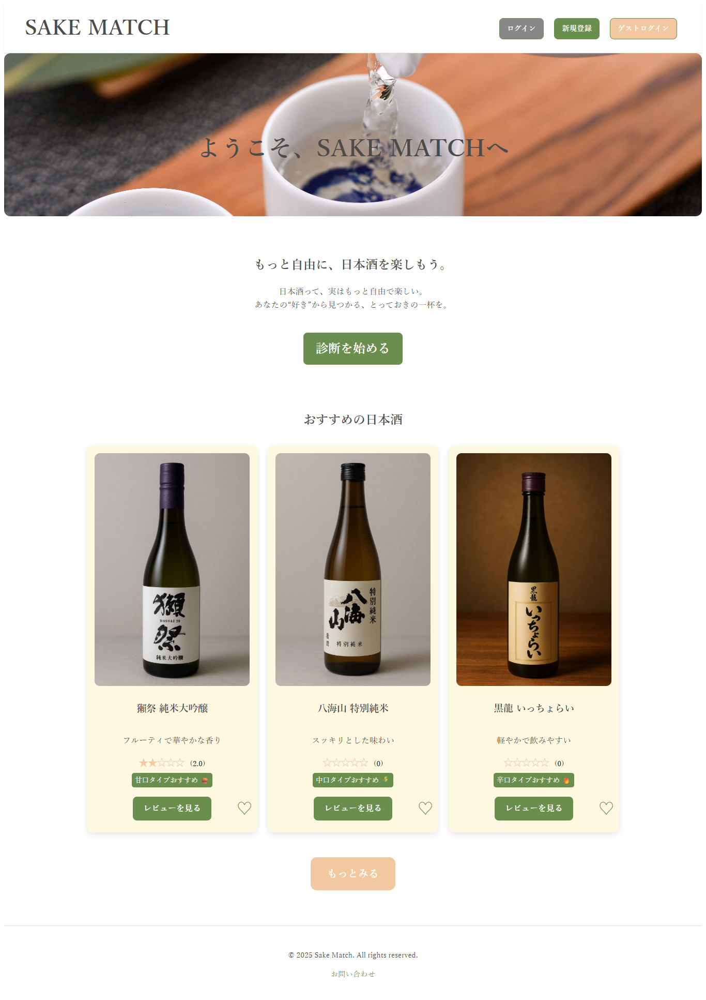
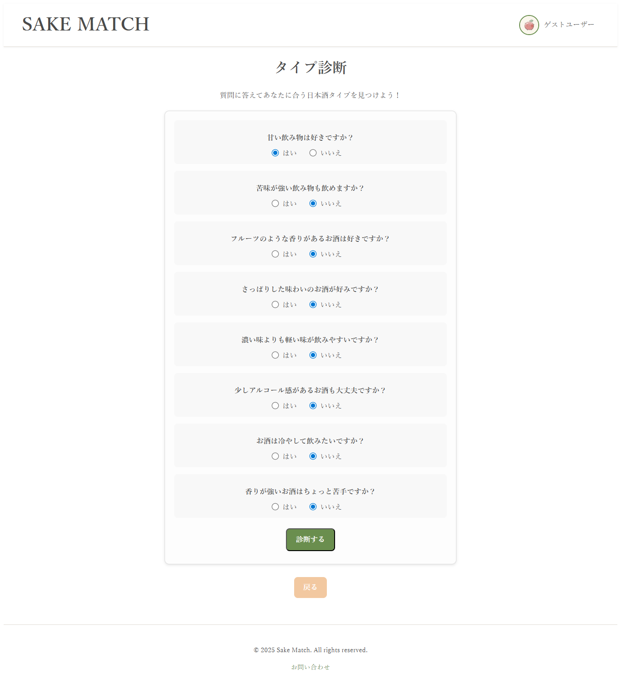
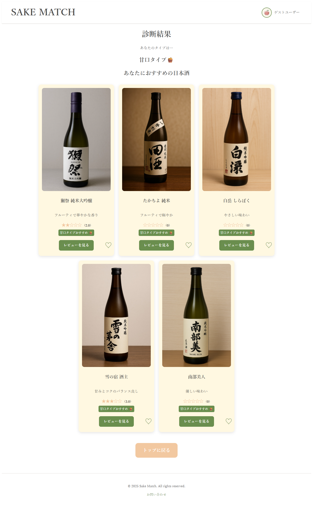
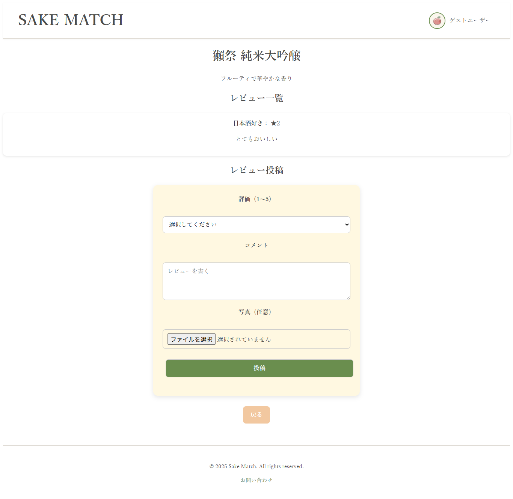
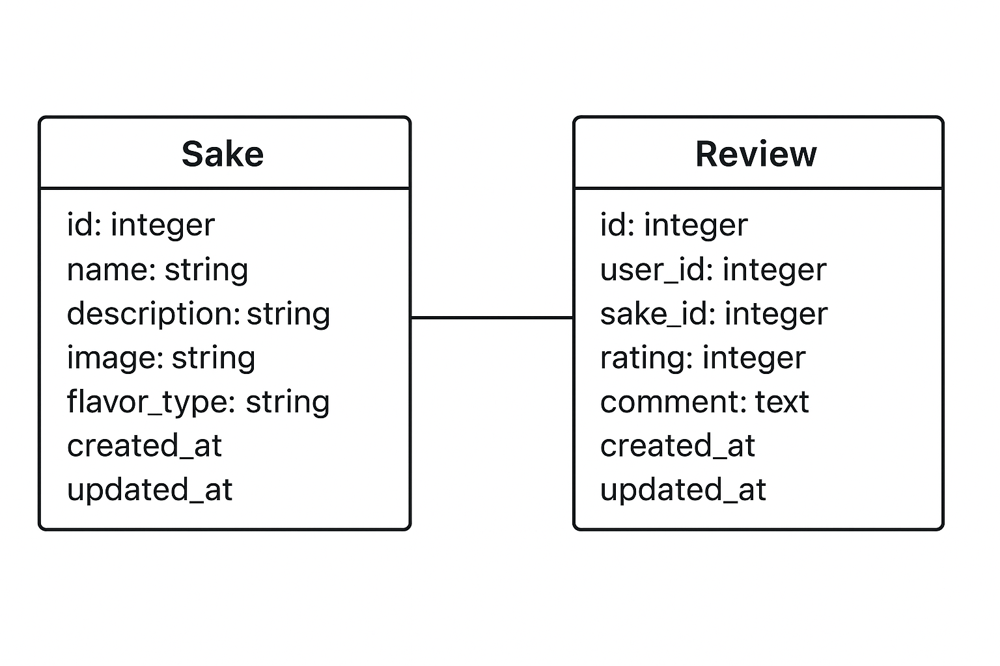

# SAKE MATCH- 日本酒マッチングアプリ

> もっと自由に、日本酒を楽しもう。
日本酒って、実はもっと自由で楽しい。
あなたの“好き”から見つかる、とっておきの一杯を。

日本酒に興味があるユーザー向けに、タイプ診断結果をもとにおすすめの日本酒を提案し、  
レビュー・お気に入り機能で情報を共有できるWebアプリです。

---

## 1. サービス概要
- ユーザーの好みをタイプ診断で分析  
- 診断結果に基づいて、日本酒をカード形式でおすすめ表示  
- 日本酒に対してレビューやお気に入り登録が可能  
- 自分のお気に入りやレビュー履歴を記録して、継続的に日本酒選びをサポート

---

## 2. サービス画像
  
- ホーム画面  
アプリのトップページ。おすすめの日本酒カードや「診断を始める」ボタンなど、全体の雰囲気がわかる画面です。  

- タイプ診断画面 
ユーザーが質問に回答して自分のタイプを診断するページ。  
シンプルで直感的に回答できるデザインを意識しました。

- タイプ診断結果画面
タイプ診断の結果に応じて、おすすめの日本酒がカード形式で表示されます。  
レビューリンクやお気に入りボタンも確認可能。  

 

- レビュー投稿・一覧画面  
実際にユーザーが投稿したレビューを確認・投稿できるページ。  
星評価とコメントで、他の人のレビューを参考にできます。  

---

## 3. サービスのURL
`https://portfolio-kwmn.onrender.com/`

---

## 4. アプリの特徴
- **タイプ診断**：質問に答えるだけで自分に合う日本酒を提案  
- **日本酒カード**：名前・画像・味タイプ・説明・レビューリンクを表示  
- **レビュー機能**：星評価＋コメントで共有  
- **お気に入り登録**：気に入った銘柄をマイページで管理  
- **シンプルUI**：女性や初心者も直感的に操作可能

---

## 5. 開発背景
- 「自分に合う日本酒がわからない」という課題を解決  
- タイプ診断でおすすめの日本酒を提示し、レビューで情報共有  
- シンプルで視覚的なデザインにより、ユーザー体験を向上

---

## 6. 現在の機能（詳細）

### 6-1. タイプ診断
- 簡単な質問に答えることでユーザーの好みや傾向を分析  
- 診断結果に基づきおすすめの日本酒をカード形式で表示  

### 6-2. 日本酒一覧（カード表示）
- 日本酒の名前、画像、味のタイプ（甘口・辛口など）、説明文をカードで表示  
- 「レビューを見る」ボタンで詳細へ遷移  

### 6-3. レビュー機能
- 日本酒ごとにレビュー投稿が可能  
  - 評価：1〜5（星マークで表示）  
  - コメント：自由入力で感想を記録  
- マイページでレビューの編集・削除が可能  

### 6-4. お気に入り機能
- 日本酒カードをお気に入り登録  
- マイページでお気に入り一覧を確認可能  

---

## 7. 主な使用技術

### フロントエンド
- HTML / CSS / JavaScript

### バックエンド
- Ruby 3.3.3  
- Ruby on Rails 6.1.7.10  
- SQLite

### インフラ・開発環境
- Git / GitHub（バージョン管理）  
- Render

---

## 8. ER図
 
※ 現在は「日本酒（sakes）」「レビュー（reviews）」テーブルを中心に構築。

---

## 9. 今後の展望

### 9-1. 直近の修正予定
- ユーザー認証機能の追加  
- CRUD処理の拡張  
- UI/UX改善（レスポンシブ対応）  

### 9-2. 中長期的な目標
- 管理者用データ登録・編集機能  
- 診断結果の詳細管理機能  
- レビュー分析・ランキング機能  
- コミュニティ共有機能  

### 9-3. 学習・開発スタンス
本アプリはRails学習の一環として制作中です。  
今後も新機能の追加やUI改善を通じて、Web開発スキルを高めていきます。
